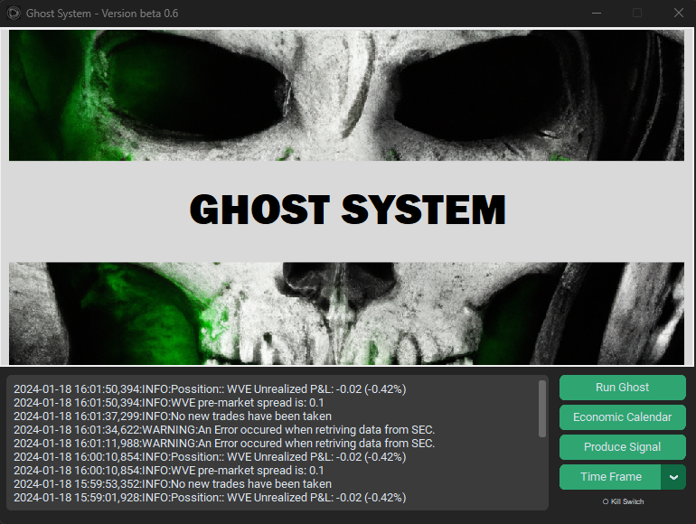

# Ghost Trading System
<br>
**Ghost** is a sophisticated algorithmic trading system designed for real-time market analysis, signal generation and execution, automated position management, and detailed profit and loss tracking. The platform includes a distinctive dark-themed graphical interface and integrates multiple data sources and libraries for high-performance trading workflows.

## How does it work? (High-Level View)
You start by specifying the time frame you want — this determines how far back the bot will go to gather insider buying information. Using Selenium, the system scrapes the official SEC forms publication site and extracts all relevant recent filings. It specifically looks for significant insider buying activity on medium-cap, small float stocks.

Once this is complete, the bot generates a .csv file containing a list of potential stocks. After the signal is ready, you can activate the trading algorithm, which analyzes each candidate’s financial and statistical profile (e.g. current price, trading volume, bid-ask spread, etc.).

Based on this analysis, the system monitors for buying opportunities, enters positions when conditions are met, and automatically exits by market close. If the trade moves against you, the system will cut the loss early. It continuously tracks your P&L in real-time, and if needed, you can instantly shut down all open positions using the built-in kill switch.

A bonus feature is the financial calendar built into the platform, which displays upcoming macro events and market-moving catalysts to help you account for exogenous risk factors.

## Features

- Real-time financial market data analysis
- Automated trade signal generation and execution
- Dynamic position sizing and management
- Comprehensive P&L tracking and logging
- Dark-themed user interface built with `customtkinter`
- Integration with FMTP-API for financial market data

## Requirements

Install the required packages using:

```bash
pip install -r requirements.txt
```

## FMTP API Setup

To use the FMTP-API:

1. Create a file named `secret.yaml` in the root directory.
2. Add your API key in the following format:

```yaml
api_key: your_fmtp_api_key_here
```
read more here: https://site.financialmodelingprep.com/developer/docs

## Getting Started

1. Clone this repository to your machine:

```bash
git clone https://github.com/your-username/ghost.git
cd ghost
```

2. Make sure you have Python 3.8+ installed.

3. Install required packages:

```bash
pip install -r requirements.txt
```

4. Configure `secret.yaml` as described above.

5. Run the system from the main script:

```bash
python exe.py
```

## Folder Structure

```
ghost/
├── exe.py                 # Main execution script
├── fmp_api.py             # Market data access via FMTP
├── ghost_bv05.py          # Trading signal logic
├── ghost_signal_bv02.py   # Additional signal strategies
├── ghost_global.py        # Shared constants and utilities
├── secret.yaml            # API keys (not committed)
├── requirements.txt       # Required dependencies
├── README.md              # Project documentation
```

## Disclaimer

This project is for educational and experimental purposes only. It is not intended for live trading or financial advice. Use at your own risk and ensure compliance with all applicable financial regulations.

## License

Proprietary — for personal or internal use only.
